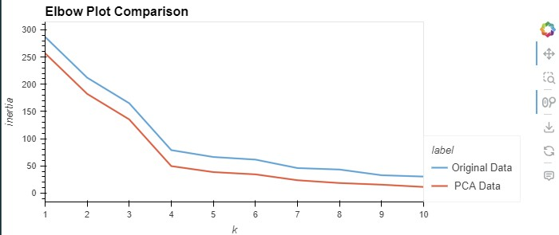
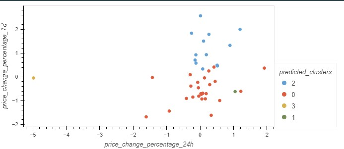
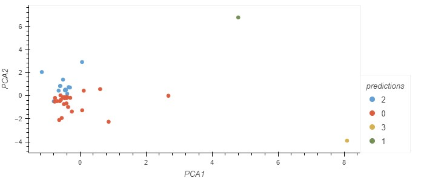

# Cryptocurrency Market Clustering with K-Means and PCA

This Jupyter Notebook analyzes cryptocurrency market trends by applying **K-Means clustering** and **Principal Component Analysis (PCA)** to price change data. The goal is to identify similar cryptocurrencies based on their short-term (24h) and medium-term (7d) price performance and visualize the groupings for further insight.

---

## File Structure

- **`Crypto_Clustering.ipynb`**  
  Main notebook that:
  - Loads cryptocurrency market data
  - Applies K-Means clustering
  - Visualizes data using original and PCA-reduced features
  - Compares clustering results using interactive scatter plots with `hvPlot`

---

## Features

- **K-Means Clustering:**  
  Groups cryptocurrencies into clusters based on their 24-hour and 7-day price change percentages.
  
- **Dimensionality Reduction with PCA:**  
  Reduces high-dimensional data for better visualization while preserving variance.

- **Interactive Visualization:**  
  Uses `hvPlot` for scatter plots that allow hovering to reveal each cryptocurrency's identity (`coin_id`).

---

## Requirements

Ensure you have the following packages installed:

```bash
pip install pandas scikit-learn hvplot
```

Also enable the `hvplot` extension for interactive plots:

```python
import hvplot.pandas
```

---

## How to Run

1. Open the notebook in Jupyter Lab or Jupyter Notebook.
2. Run all cells to:
   - Load data
   - Fit a clustering model
   - Visualize clusters in both original and PCA-transformed space

---

## Outputs

- Elbow plots for the original data and pca data were similar.

- Scatter plot of cryptocurrencies grouped by predicted clusters

- PCA-transformed scatter plot showing the same clusters in reduced dimensional space



---

## Insights

- Similar cluster patterns appear in both original and PCA plots, indicating good initial feature separation.
- PCA mainly reorients the data without significantly changing cluster structure.
- Could explore additional features or advanced clustering (e.g., DBSCAN) for deeper insights.


